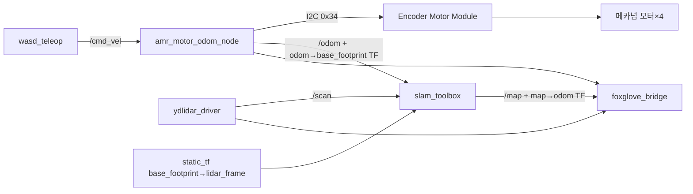

# AMR (지상 자율주행 로봇) — 셋업 & 운용 README

드론×AMR 물류 재고 스캔 솔루션의 **지상 AMR(자율주행 대차)** 파트.
메카넘 4WD 섀시 + Raspberry Pi 4 + Encoder Motor Module(I2C) + YDLIDAR G4로
SLAM 매핑/자율주행을 수행한다.

> 이 문서 하나로 **하드웨어 배선 → 라즈베리파이 셋업 → 코드 → 실행**까지 재현 가능하도록 정리.

---

## 0. 시스템 개요

```
                ┌─────────────────────────────────────────────┐
                │              Raspberry Pi 4 (두뇌)           │
                │   Ubuntu 22.04 (arm64) + ROS2 Humble         │
                │                                              │
   USB ─────────┤  ydlidar 드라이버 → /scan                    │
 (LiDAR DATA)   │  amr_motor_odom_node → /odom, TF, /cmd_vel←  │
                │  slam_toolbox → /map                         │
   I2C ─────────┤  (GPIO2/3)                                   │
 (모터/엔코더)   └─────────────────────────────────────────────┘
                          │                    │
                  ┌───────┴───────┐     ┌──────┴───────┐
                  │ Encoder Motor │     │  YDLIDAR G4  │
                  │  Module V1.3  │     │ (2D 라이다)   │
                  │   (I2C 0x34)  │     └──────────────┘
                  └───────┬───────┘
                   메카슘 모터×4 (+엔코더)
```

- **호스트(두뇌)**: RPi4 — ROS2 노드 구동, SLAM 연산
- **모터 제어**: Encoder Motor Module V1.3 — I2C로 모터 구동 + 엔코더 읽기 (IMU 없음)
- **거리 센서**: YDLIDAR G4 — 2D 스캔(/scan), SLAM/장애물 인식의 핵심
- **오돔**: 바퀴 엔코더 기반(개루프 아님) → 맵 정확도 ↑

> ⚠️ 과거에 쓰던 **Hiwonder ROS Robot Controller V1.2(/dev/rrc, USB시리얼, IMU 내장)**는
> 통신 USB-C 포트(CH9102F)가 하드웨어 사망하여 **폐기**. 현재는 Encoder Motor Module(I2C) 경로.

---

## 1. 하드웨어 구성

### 1.1 부품 목록

| 부품 | 모델 | 비고 |
|---|---|---|
| 섀시 | Hiwonder Large Metal 4WD Vehicle Chassis (Green) | 메카넘 4WD, 12V 엔코더기어모터×4 (110RPM), 동작 9~12V |
| 모터 컨트롤러 | Hiwonder **Encoder Motor Module V1.3** | 4채널 엔코더 모터 드라이버, **I2C 주소 0x34**, IMU 없음 |
| 호스트 | Raspberry Pi 4 | Ubuntu 22.04 arm64, hostname `dhl-amr`, user `piapp` |
| 라이다 | YDLIDAR **G4** | USB 어댑터 CP2102(`10c4:ea60`), 230400 baud |
| 배터리 | 11.1V 3S LiPo (벤치는 12V 배터리/어댑터) | 모터 VIN 9~12V |
| 벅 컨버터 | 듀얼 독립 채널 강압(12V→5V), USB-A 출력×2 | Pi(USB-C)·라이다(micro-USB) 각각 |

### 1.2 전원 배선도

```
            ┌──────────────┐
            │  배터리 12V   │  (11.1V 3S LiPo 권장 / 벤치는 12V)
            └──────┬───────┘
                   │  (선 2가닥으로 분기)
        ┌──────────┴───────────┐
        ▼                      ▼
 ┌──────────────┐       ┌──────────────┐
 │ Encoder Motor│       │ 벅 컨버터     │ 12V→5V (각 채널 5.1V로 트리머 조정)
 │  Module VIN  │       │ 듀얼 USB-A 출력│
 │ (모터 구동)   │       └──┬────────┬──┘
 └──────────────┘          │        │
                    USB-A→C │        │ USB-A→micro
                           ▼        ▼
                      Pi4 (5V)   LiDAR USB_PWR (보조 5V)
```

- 배터리 → **모듈 VIN 직결**(모터 큰 전류) + **벅 → 5V → Pi & 라이다 보조전원**.
- 모듈 I2C의 5V 핀으로는 **Pi 전원 공급 불가**(소전류) — 반드시 벅 사용.
- 벅 출력은 **부하 분리 후 멀티미터로 5.1V 확인 → 그다음 Pi/라이다 연결** (5.25V 초과 금지: Pi 손상).

### 1.3 신호 배선

**I2C (Pi ↔ Encoder Motor Module)**

| Pi 핀 (물리) | 신호 | 모듈 |
|---|---|---|
| pin 3 (GPIO2) | SDA | SDA |
| pin 5 (GPIO3) | SCL | SCL |
| GND (pin 6 등) | GND | GND (**공통 필수**) |

**라이다 (USB)**

- `USB_DATA` → Pi USB 포트 (스캔 데이터 → /scan)
- `USB_PWR` (micro-USB 5핀) → 벅 5V (모터 전류 커서 보조전원 필수, 없으면 오작동)

**모터 (4× 6핀 케이블)**

- 각 모터의 6핀 케이블(모터 전원 2 + 엔코더 4) → 모듈의 M1~M4 포트.

### 1.4 모터 채널 매핑 (보정 대상)

`amr_motor_odom_node.py` 상단에서 설정:

```python
FL, FR, RL, RR = 1, 2, 3, 4   # 바퀴 코너 ↔ 보드 모터채널
DIR = {1:+1, 2:+1, 3:+1, 4:+1} # 전진 시 거꾸로 도는 바퀴는 -1
```

→ 실제 배선에 맞게 **방향 확인 후 보정**(6장 참조).

---

## 2. 라즈베리파이 셋업

> 📄 **전체 설치 단계(OS 이미징 → ROS2 → 소스/라이다 빌드 → udev → I2C → venv)는
> [`docs/rpi4_setup.md`](docs/rpi4_setup.md) 참고.** 아래는 요약.

- **OS**: Ubuntu Server 22.04 LTS **64-bit(arm64)** — 32-bit(armhf) 금지.
- **ROS2**: Humble (`ros-humble-desktop` + `ros-dev-tools`).
- **환경변수**(`~/.bashrc`): `ROS_DOMAIN_ID=42`, `MACHINE_TYPE=JetAuto`, `HOST/MASTER=jetauto`, `need_compile=True`, `LIDAR_TYPE=G4`.
- **빌드**: Hiwonder 소스(`amr_build_setup.sh`, 라이다 launch·SLAM 설정용) + 라이다 드라이버(`lidar_g4_driver_build.sh`, ★humble 브랜치).
- **udev**: `/dev/lidar`(`10c4:ea60`).
- **I2C 활성화**: `/boot/firmware/config.txt`에 `dtparam=i2c_arm=on` → 재부팅 → `i2cdetect -y 1`에 `0x34`.
- **venv**: `amr_env_setup.sh` → `~/amr_env` (**반드시 `--system-site-packages`**, 아니면 `rclpy` import 실패). 매 작업 시 `source ~/amr_env/activate_amr.sh`.

자세한 명령·전송(scp)·검증은 [`docs/rpi4_setup.md`](docs/rpi4_setup.md).

---

## 3. 코드 / 스크립트

모든 파일은 한 폴더(예: `~/amr_lidar_viz/`)에 함께 둔다.

### 3.1 파일 목록

| 파일 | 역할 |
|---|---|
| `amr_env_setup.sh` | venv(`~/amr_env`, --system-site-packages) 생성 + 의존성 + 활성화 헬퍼 |
| `amr_motor_odom_node.py` | **메인 노드** — /cmd_vel→메카넘→I2C 구동, 엔코더→/odom+TF |
| `wasd_teleop.py` | WASD 키보드 텔레옵 → /cmd_vel |
| `run_mapping.sh` | **올인원 SLAM 실행** — 라이다+오돔+TF+slam_toolbox+Foxglove+텔레옵, 종료 시 맵 자동저장 |
| `motor_i2c_test.py` | 인터랙티브 모터 진단(순차 식별/개별 구동/엔코더 모니터) |
| `module_health.py` | I2C/전원 안정성 체커(끊김·리셋·VIN 측정) |
| `motor_load_test.py` | 모터 부하 시 VIN 강하 측정(전류부족 판별) |
| `motor_init_test.py` | MOTOR_TYPE 설정 후 PWM/SPEED 구동 시험 |

### 3.2 핵심 노드 동작 (`amr_motor_odom_node.py`)
- `/cmd_vel`(Twist) 구독 → 메카넘 역기구학 → **SPEED 모드(reg51)** 로 4채널 구동.
- 엔코더(reg60) 읽어 전진기구학 → `/odom` 발행 + `odom→base_footprint` TF.
- 명령 끊기면(0.5s) 자동 정지. 2초마다 하트비트 로그.
- 상단 튜닝 파라미터: 차체 치수, `PULSES_PER_REV`, `FL/FR/RL/RR`, `DIR`.

---

## 4. 실행 방법

### 4.1 초기 1회
```bash
bash amr_env_setup.sh        # venv
# (2.4~2.7 빌드/udev/I2C가 끝났다는 전제)
```

### 4.2 모터 브링업 테스트 (순서대로 — 처음 조립/배선 후)
```bash
source ~/amr_env/activate_amr.sh
i2cdetect -y 1                 # 0x34 보이는지
python3 module_health.py       # I2C/전원 안정성 (성공률 100% & VIN 안정 확인)
python3 motor_init_test.py     # ★ MOTOR_TYPE 설정 후 SPEED 모드로 4모터 구동 확인
python3 motor_i2c_test.py      # 인터랙티브로 개별/방향 확인
```
> **반드시 바퀴를 공중에 띄우고** 테스트.

### 4.3 SLAM 매핑 (올인원)
```bash
bash ~/amr_lidar_viz/run_mapping.sh
```
- `✅ /scan` `✅ /odom` 뜰 때까지 대기 → 같은 창에서 **WASD 운전**.
  - `w/s` 전진/후진, `a/d` 좌/우 평행, `q/e` 좌/우 회전, `space`/`k` 정지, `+/-` 속도.
- **Ctrl-C** → 맵 자동 저장: `~/maps/warehouse_<날짜시각>.pgm/.yaml`
- 로그: `/tmp/map_*.log` (lidar/odom/tf/slam/foxglove)

### 4.4 Foxglove 시각화 (Mac)
1. Pi에서 `run_mapping.sh` 실행(bridge 자동 기동, 포트 8765).
2. Mac **Foxglove Studio** → Open connection → **"Foxglove WebSocket"**(★Rosbridge 아님!).
3. 주소 `ws://dhl-amr.local:8765` (안 되면 Pi IP).
4. 3D 패널 Display frame = **`map`**, 토픽 `/map`·`/scan`·**TF** 추가.

---

## 5. Encoder Motor Module I2C 프로토콜 (검증됨)

- **주소**: `0x34`, 버스 1 (`/dev/i2c-1`)

| 레지스터 | 이름 | 설명 |
|---|---|---|
| 20 | MOTOR_TYPE | 모터 종류. **3 = JGB37 12V 110RPM(우리 모터)**. 0=무엔코더,1=TT,2=N20 |
| 21 | ENCODER_POLARITY | 엔코더 방향(0/1) |
| 31 | FIXED_PWM | 개루프 PWM — **이 보드에선 미작동** |
| 51 | FIXED_SPEED | **폐루프 속도(pulse/10ms, signed)** — 실제 구동에 사용 |
| 60 | ENCODER_TOTAL | 엔코더 누적 4×int32 (16바이트, little-endian) |
| 0 | VIN | 입력 전압(mV, 2바이트 LE) — 실측 검증됨 |

> **핵심 교훈 (실증)**:
> 1. **MOTOR_TYPE(reg20=3) + 엔코더극성(reg21)을 먼저 등록**해야 출력단이 켜짐.
> 2. **개루프 PWM(reg31)은 안 먹음 → 폐루프 SPEED(reg51)로만 구동.** (오돔 정확도에도 유리)

---

## 6. 보정 (Calibration) — SLAM 전에 필수

1. **모터 방향**: 텔레옵 `w`(전진) 시 4바퀴 모두 앞으로 도는지 확인.
   거꾸로 도는 채널은 `amr_motor_odom_node.py`의 `DIR`을 `-1`로. (M1~M4 코너 매핑도 이때 확정)
2. **오돔 스케일**: 실제 **1m** 직진 후 `/odom`의 x값 확인. 어긋나면
   `PULSES_PER_REV = 현재값 × (odom값 / 1.0)` 로 보정. (현재 5764는 레퍼런스값)
3. **라이다 장착 TF**: `run_mapping.sh`의 static_transform_publisher에서
   `--z`(라이다 높이), 라이다 0도가 로봇 정면이 아니면 `--yaw` 보정.

---

## 7. 알려진 이슈 / 함정

- **유령 노드(미해결)**: 같은 `ROS_DOMAIN_ID=42`를 쓰는 다른 머신이 네트워크에 있으면
  slam_toolbox/필터 노드가 중복·TF_OLD_DATA·토픽 혼선 발생. → 다른 머신 끄거나 DOMAIN_ID 격리.
- **벅 출력 전압**: 트리머(103=10kΩ, 다회전)로 조정. **부하 분리 후 멀티미터로 5.1V 확인** 뒤 연결.
- **Foxglove 연결**: 반드시 "Foxglove WebSocket"(Rosbridge 선택 시 연결 실패).
- **라이다 경고** `Real points > fixed points` 는 무해.
- **`ros2 topic echo --once`로 준비 확인 금지**: 콜드스타트 1~2초라 짧은 타임아웃에 거짓 "없음".
  → 토픽 존재(`ros2 topic list`)로 확인(run_mapping.sh 적용됨).
- **모터 안 돎인데 전원 느낌만**: 부하 시 VIN 강하 측정(`motor_load_test.py`)으로 전류부족/배선 판별.

---

## 8. 진행 상태 / 다음 단계

**완료**
- RPi4 + Ubuntu22.04 + ROS2 Humble + Hiwonder 소스 빌드
- 라이다 G4 `/scan`, Foxglove 파이프라인
- Encoder Motor Module I2C 구동(SPEED 모드) + 4모터 회전 확인
- I2C 모터+엔코더 오돔 노드, WASD 텔레옵, 올인원 run_mapping

**다음**
- 모터 방향/오돔 스케일/라이다 TF 보정(6장)
- 깨끗한 SLAM 맵 생성 → Nav2 자율주행(지정 랙 ±5cm 정지)
- 유령 노드(DOMAIN_ID) 격리
- 전원 최종(11.1V LiPo 팩 + 벅 5.1V 고정)

---

## 부록: ROS 노드 그래프 (매핑 시)


